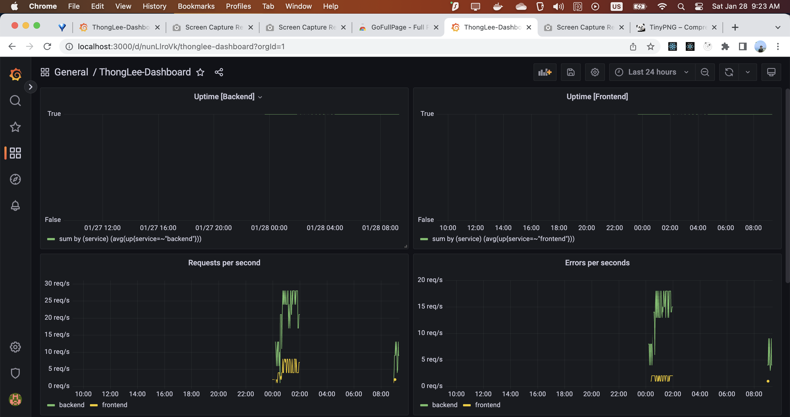
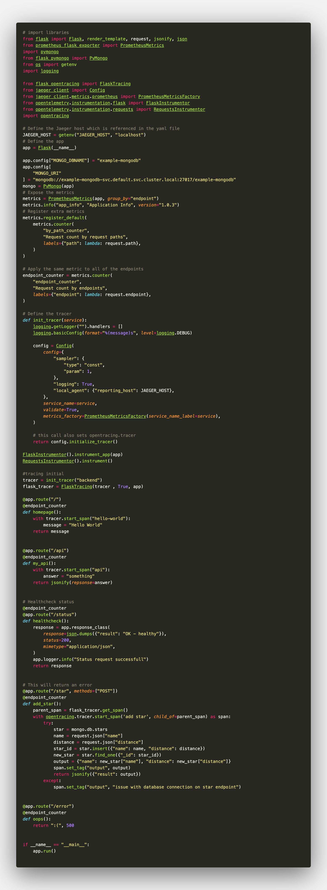

## Architecture Overview


## Verify the monitoring installation

Run `kubectl` command to show the running pods and services for all components.


## Setup the Jaeger and Prometheus source
Expose Grafana to the internet and then setup Prometheus as a data source.


## Create a Basic Dashboard
Create a dashboard in Grafana that shows Prometheus as a source.


## Describe SLO/SLI

> An SLA (service level agreement) is an agreement between provider and client about measurable metrics like uptime, responsiveness, and responsibilities. --[atlassian](https://www.atlassian.com/incident-management/kpis/sla-vs-slo-vs-sli)

> An SLO (service level objective) is an agreement within an SLA about a specific metric like uptime or response time -- [atlassian](https://www.atlassian.com/incident-management/kpis/sla-vs-slo-vs-sli)

> An SLI (service level indicator) measures compliance with an SLO (service level objective) -- [atlassian](https://www.atlassian.com/incident-management/kpis/sla-vs-slo-vs-sli)

Therefore, The following SLIs based on SLO of *monthly uptime* and *request response time* may include, but not limited here:
+ The average percent of uptime this month was 95.5%
+ The average time taken to return a request was 211ms

## Creating SLI metrics.
It is important to know why we want to measure certain metrics for our customer. Describe in detail 5 metrics to measure these SLIs. 

+ Latency -  The time taken to serve a request (usually measured in ms).
+ Uptime - Time a service is active
+ Failure Rate/Errors -  The number of requests that are failing (such as number of HTTP 500 responses).
+ Traffic - The amount of stress on a system from demand (such as the number of HTTP requests/second)
+ Saturation - The overall capacity of a service (such as the percentage of memory or CPU used).

## Create a Dashboard to measure our SLIs
Create a dashboard to measure the uptime of the frontend and backend services We will also want to measure to measure 40x and 50x errors. Create a dashboard that show these values over a 24 hour period.



## Tracing our Flask App
We will create a Jaeger span to measure the processes on the backend. Also provide a (screenshot) sample Python file containing a trace and span code used to perform Jaeger traces on the backend service.



## Jaeger in Dashboards
Now that the trace is running, let's add the metric to our current Grafana dashboard.


## Report Error
Using the template below, write a trouble ticket for the developers, to explain the errors that you are seeing (400, 500, latency) and to let them know the file that is causing the issue also include a screenshot of the tracer span to demonstrate how we can user a tracer to locate errors easily.

TROUBLE TICKET

Name: API /star returned 500 error

Date: 2023-01-27 10:15:43.683

Subject: Error 500 in POST-method API /star

Affected Area: Python Flask backend service

Severity: High

Description:
```
  TraceID: 20eec11f0a6a18ca
  {
    "key": "http.url",
    "type": "string",
    "value": "http://localhost:8080/star"
  }
  {
    "key": "http.method",
    "type": "string",
    "value": "POST"
  }
  {
    "key": "component",
    "type": "string",
    "value": "Flask"
  }
  {
    "key": "hostname",
    "type": "string",
    "value": "backend-6d96f87dd7-gqdfn"
  }
  {
    "key": "output",
    "type": "string",
    "value": "issue with database connection on star endpoint"
  }
```

## Creating SLIs and SLOs
We want to create an SLO guaranteeing that our application has a 99.95% uptime per month. Name four SLIs that you would use to measure the success of this SLO.

* Uptime: The application's uptime this month was 99.95% within a month.
* Failure Rate: The total status code error 5XX was less than 10% within a month.
* Latency: The time taken to serve a request was less than 30ms within a month.
* Traffic: The application managed to handle 200000 of HTTP requests per second
* Saturation: The memory and CPU utilization was less than 70% within a month

## Building KPIs for our plan
Now that we have our SLIs and SLOs, create a list of 2-3 KPIs to accurately measure these metrics as well as a description of why those KPIs were chosen. We will make a dashboard for this, but first write them down here.

1. Uptime:
  * Uptime ratio > 90% within a month: To gurantee the availability of the app for the client
  * Downtime ratio < 10%
2. Failure Rate:
  * Errors rate < 10% within a month
3. Latency:
  * The average time to handle request within a month is < 30ms: To gurantee the experience of client.
4. Traffic: 
  * Schedule the resources to manage to handle 200000 HTT requests per second
5. Saturation:
  * Schedule the resources to auto scale to 30% when nearly reach 80%

## Final Dashboard
Create a Dashboard containing graphs that capture all the metrics of your KPIs and adequately representing your SLIs and SLOs. Include a screenshot of the dashboard here, and write a text description of what graphs are represented in the dashboard.  


The dashboard includes these metrics:
<!-- - TODO Pods Uptime -->
- Error Requests Measurement(reqs/s)
- Average response time(ms)
- Requests per second
- CPU Usage (per pod)
- Memory Usage (per pod)
